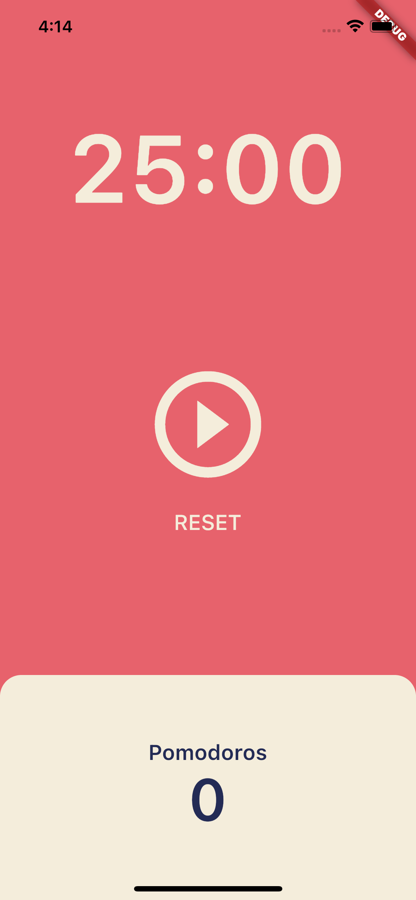
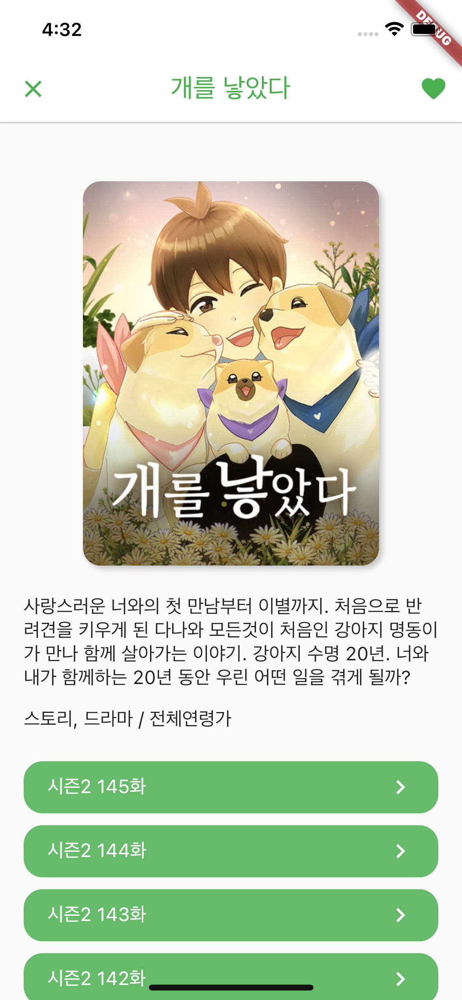
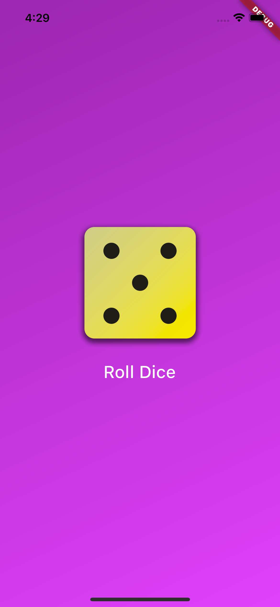
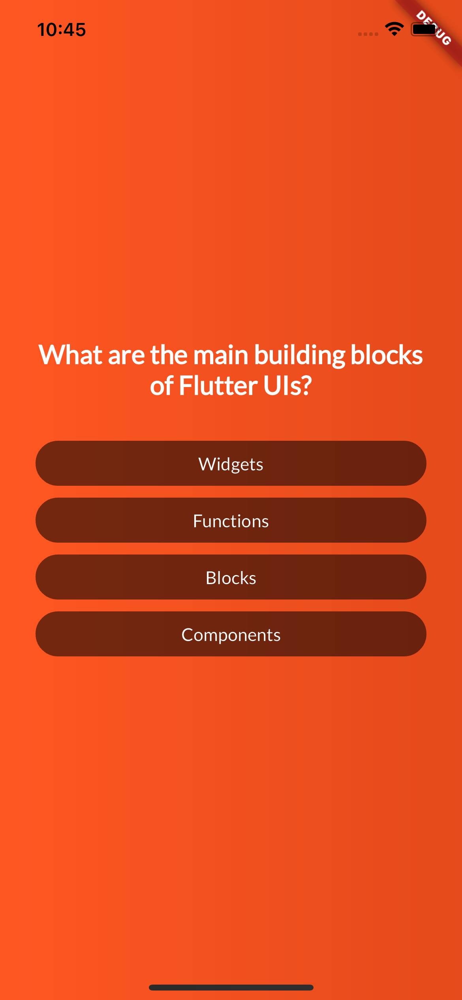
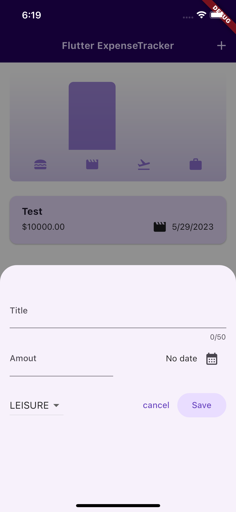

## flutter_study

- 강의1 : https://nomadcoders.co/flutter-for-beginners

- 강의2 : https://www.udemy.com/course/learn-flutter-dart-to-build-ios-android-apps

### Example Apps

1. Wallet app

2. Pomodoros app

3. Toonflix app

4. Dice app

5. Quiz app

5. Expense tracker app

